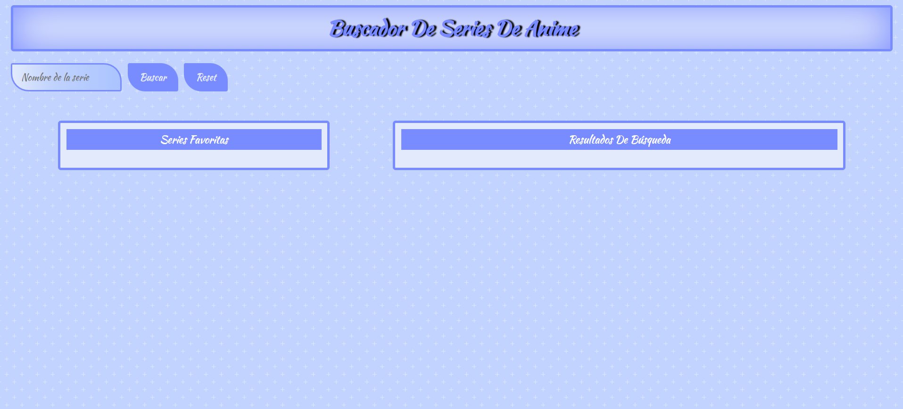
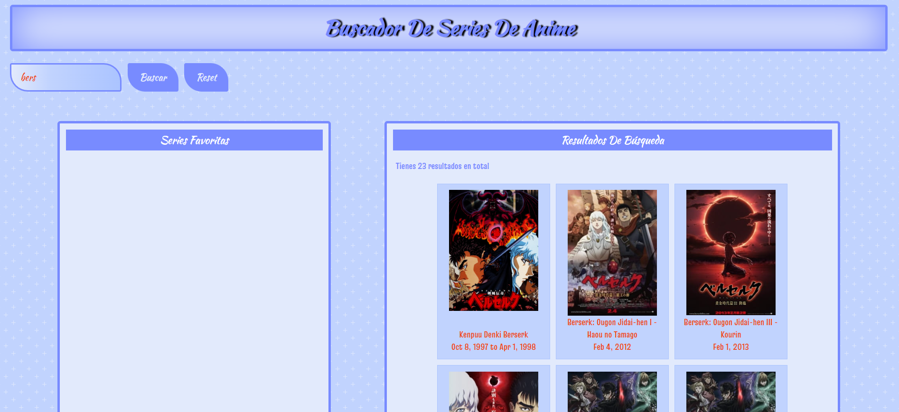
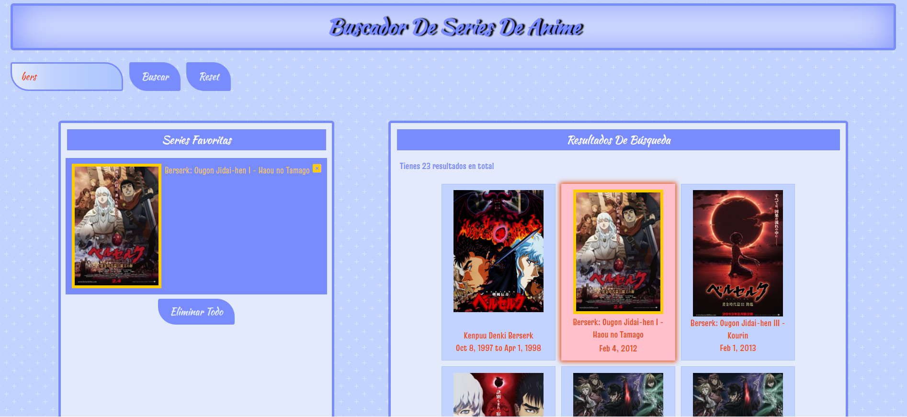

# modulo-2-evaluacion-final-carrodriguezp

## Description

This project is a responsive website layout exercise using **node y vite** , It is built using **HTML**, **SCSS** and **JavaScript**, providing a clean design for easy customization. 

The wesite consists of developing a web application to search for anime series, which allows us to select the series as favorites and save them in local storage.

In the project we have used adalab's started Kit, which includes an HTML template engine, the SASS preprocessor and a local server and many other things. 

This Kit helps us to work more comfortably, since it automates tasks.

In the Kit there are 3 types of files and folders:

- The files that are loose in the repository root, such as vite.config.js, package.json.... They are the configuration of the project and we don't need to modify them (except this README.md, to describe your project).
- The `src/` folder: are the files of our web page, like HTML, CSS, JS...
- The `public/` folder, that has static files like images, fonts, favicon, old JavaScript libraries (jQuery, ...)
- And the `docs/` folder, which is automatically generated when we start the project. Kit reads the files inside `src/` and `public/`, processes them and generates them inside `public/` and `docs/`.

## Table of Contents

- Quick Start Guide
- Installation
- Usage
- Deployment
- Proyect structure
- Screenshots
- License

## Quick Start Guide

> **NOTE:** You need to have [Node JS](https://nodejs.org/) installed with a version higher than 14 to work with Adalab Starter Kit.

## Installation

To get started with this project, follow these steps:

1. Clone the repository to your local machine:

```bash

git clone https://github.com/your-username/project-name.git
```

2. Open the project folder in your preferred code editor.

3. Run a local development server (you can use tools like Live Server or any other server of your choice).

```bash
npm install  
npm start
```

## Usage

After the installation, open the project in your browser and navigate through the sections to explore the content. 

Because this website is about anime series, where they can be found through search, an API has been used to ensure the functionality of it.

The size of the elements has been adapted using rem units instead of px, for example in font size, which ensures better responsiveness and adaptability to various devices.

## Deployment

To deploy this proyect, please use the command bellow:

```bash
npm run deploy
```

## Proyect structure

Please find folder structure below:

```
src
 ├─ img
 |  └─ kanji.PNG
 ├─  js 
 |   └─ main.js
 ├─ partials
 |  └─ main.html
 ├─ scss
 |  ├─ core
 |  ├─ layout
 |  └─ main
 └─ index

```
##Screenshots

####Initial view




####View after research




####View after select favorite anime




####view after refresh the website if favorites were selected


## Licence

This project is licensed under the **MIT License**. Feel free to use, modify, and distribute the code for your projects. Make sure to check the license for more details.